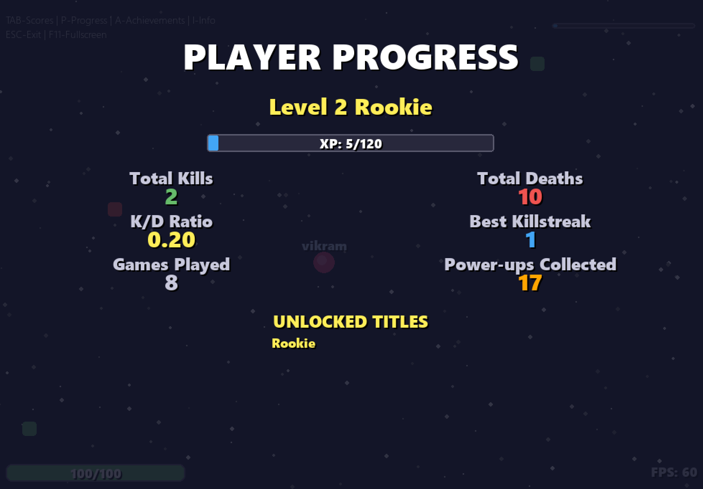

# Blastr! 💥

**An addictive, fast-paced 2D multiplayer arena shooter built with Python and Pygame**

*Jump into a neon-drenched arena, outplay your opponents, and climb the ranks in a game designed for endless replayability!*

[](https://www.python.org/downloads/)

[](https://www.pygame.org/)


---

## 🌟 More Than Just a Game - It's a Grind

Blastr! isn't just another simple shooter. It's packed with features that make every match count, inspired by addictive progression systems found in games like Hollow Knight.

### 🎯 **Core Features**

- **🏆 Full Progression System**: Every kill and power-up grants XP! Level up from Rookie to Legend, unlock player titles, and show off your veteran status
- **🎖️ Achievement Hunter**: Complete challenging milestones like massive killstreaks, survival challenges, and level-based achievements  
- **⚡ Live Multiplayer Action**: Real-time battles with smooth client-side prediction and server interpolation
- **🌊 Dynamic Arena**: Dodge lethal laser walls and fight for game-changing power-ups (Health, Speed, Damage)
- **🔥 Comeback Superpower**: Falling behind? Press **[F]** to unleash a devastating bullet storm and even the odds
- **✨ Polished Experience**: Professional UI, fullscreen support, and persistent local progress saving

---

## 🎮 How to Play

### 🎯 **Controls**
| Input | Action |
|-------|--------|
| **Mouse Movement** | Your player follows the cursor |
| **Left-Click / Space** | Shoot projectiles towards cursor |
| **Hold TAB** | Display live leaderboard |
| **F Key** | Activate superpower (when available) |
| **I Key** | Toggle "How to Play" info panel |
| **P Key** | View personal progress & stats |
| **A Key** | Check unlocked achievements |
| **F11** | Toggle fullscreen mode |
| **ESC** | Exit game |

### 🎁 **Power-ups & Elements**

#### **Power-ups**
- 🟢 **Health** - Restores 30 health points
- 🔵 **Speed** - Temporary movement speed boost  
- 🔴 **Damage** - Temporary bullet damage increase

#### **Hazards**
- 🔴 **Laser Walls** - Instantly lethal barriers that sweep the arena

#### **Progression System**
- **Level System** - Gain XP from kills, streaks, and power-ups
- **Title Unlocks** - Rookie → Apprentice → Veteran → Expert → Master → Legend
- **Achievements** - 7+ challenging objectives to complete
- **Statistics** - Track K/D, best streaks, playtime, and more

---

## ⚙️ Installation & Setup

### **Prerequisites**
- **Python 3.7+** - [Download here](https://www.python.org/downloads/)
- **Pygame 2.0+** - Install with: `pip install pygame`

### **Quick Start**

1. **Clone the Repository**
   ```bash
   git clone https://github.com/YOUR_USERNAME/blastr-game.git
   cd blastr-game
   ```

2. **Start the Server**
   ```bash
   python server.py
   ```
   *The server will listen on `localhost:5557` and wait for players*

3. **Launch the Client**
   ```bash
   # Connect locally
   python client.py
   
   # Connect to remote server
   python client.py <server_ip_address>
   ```

4. **Play!**
   - Enter your player name
   - Click "START GAME" 
   - Battle for supremacy! 🔥

---

## 🛠️ Technical Architecture

### **Core Technologies**
- **Backend**: Pure Python with socket programming
- **Game Engine**: Pygame for graphics and input handling
- **Networking**: Custom TCP implementation with real-time communication

### **Advanced Features**
- 🎯 **Authoritative Server**: Server maintains game state integrity to prevent cheating
- 📡 **Data Serialization**: Efficient Python pickle-based networking protocol
- ⚡ **Asynchronous I/O**: Handle multiple players simultaneously using `select`
- 🔮 **Client-Side Prediction**: Responsive local movement with server reconciliation
- 🎬 **Server Interpolation**: Smooth opponent movement despite network latency
- 💾 **Persistent Progress**: Local save system with JSON-based progress tracking

---

## 🎯 Development Notes

This project represents a deep dive into multiplayer game architecture, combining:

- **Custom networking protocols** built from scratch
- **Real-time synchronization** techniques used in professional games
- **Progression systems** designed for long-term player engagement
- **Polished UI/UX** with fullscreen support and dynamic scaling

While the visual polish was "vibe-coded" with Pygame, the networking foundation implements industry-standard concepts like authoritative servers, lag compensation, and client prediction.

---

## 🖼️ IN-GAME Screenshots


<p align="center">
  <br>
  <em>Main Menu / Title Screen</em>
</p>

<p align="center">
  <br>
  <em>Progress / Loading Screen</em>
</p>

<p align="center">
  <br>
  <em>Gameplay Screen</em>
</p>

<p align="center">
  <br>
  <em>Respawn / Player Death Screen</em>
</p>

<p align="center">
  <br>
  <em>Leaderboard</em>
</p>

<p align="center">
  <br>
  <em>Achievements</em>
</p>

<p align="center">
  <br>
  <em>Progress Overview</em>
</p>

<p align="center">
  <br>
  <em>Super Power / Power-Up Screen</em>
</p>


---

## 🤝 Contributing

Contributions are welcome! Whether it's:
- 🐛 Bug fixes
- ✨ New features  
- 🎨 UI improvements
- 📝 Documentation updates

Please feel free to open issues and pull requests.

### **Development Setup**
1. Fork the repository
2. Create a feature branch (`git checkout -b feature/amazing-feature`)
3. Commit your changes (`git commit -m 'Add amazing feature'`)
4. Push to the branch (`git push origin feature/amazing-feature`)
5. Open a Pull Request

---

## 📈 Roadmap

- [ ] Sound effects and background music
- [ ] More power-up types
- [ ] Tournament mode
- [ ] Spectator mode
- [ ] Replay system
- [ ] Custom maps/arenas

---

## 📜 License

This project is licensed under the **MIT License** - see the [LICENSE](LICENSE) file for details.

---

## Acknowledgments

- Built with [Pygame](https://www.pygame.org/) - Amazing Python game development library
- Inspired by classic arena shooters and modern progression systems
- Special thanks to the Python community for excellent networking resources

---

**Made with ❤️ and Python**

*Ready to become a Legend? Clone, play, and dominate the arena!*